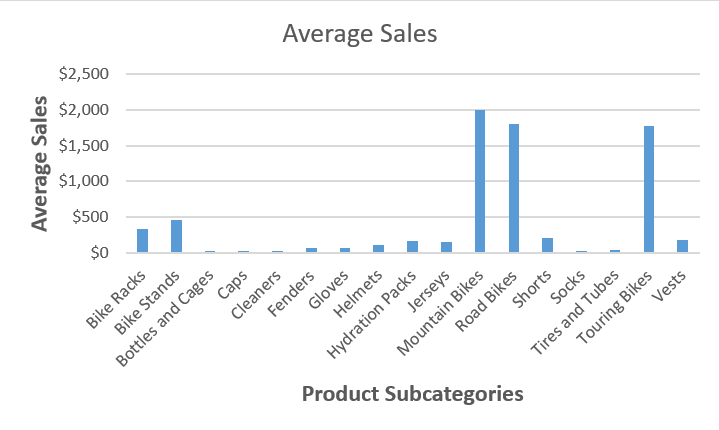
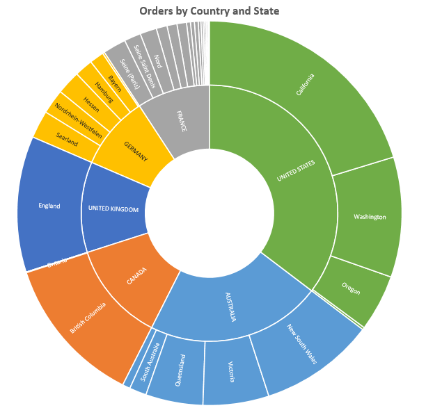
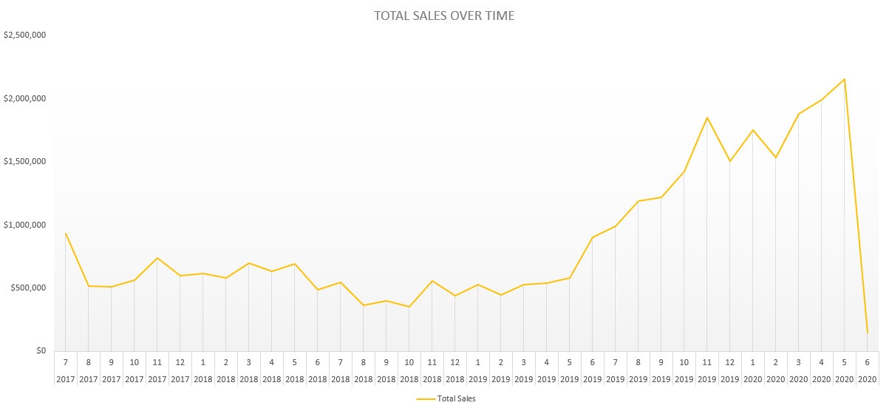

# Data Analysis With Microsoft Excel

## Introduction

> This analysis is focused on analyzing organization's sales data. The data is in an Excel Workbook and contains information on various sales made across multiple sales line for various products.

## About Dataset

The dataset used was compiled and stored as an Excel Workbook. It contains various sales data for multiple products.

The workbook contains:

* **60398** rows of sales data
* **24** columns of sales attribute.

## Work Done

Various data cleaning and formatting operations was carried out to get the desired results.

## Result

Various insights were uncovered and are explained as below.

### Average Sales Across Subcategories

The worksheet was analyzed and average sales for each subcategory was determined and saved in a new worksheet (**By Product Subcategory**). Average sales data was calculated on US Dollars.

The result of calculated average sales was further ploted in a **23 Clustered Column** chart.

From the result as shown in below graph, it was discovered that;

* **Mountain Bikes** have the highest average sales at **$2,003** which was followed closely by **Road Bikes** at **$1.800**  while **Touring Bikes** was at 3rd position at **$1,774**.
* At the opposite ends where **Bottles and Cages** which have an averages sales of **$21**, **Cleaners** followed at **$23** and then **Socks** also followed at **$27**.

#### NOTE:

> It is important to note that the product with the highest **Average Sales** doesn't automatically translate to the *Best Performer* as the purchase and selling price for each product vary by wie margins.

### Orders by Country and State

The analysis also looked at how orders were made across countries and state/region. The result of the findings was plotted using sunburn and the distribution is as below.

Looking at the graph above, we can immediately see that;

* **United States** made the largest orders. We can also see that **California** and **Washinghton** made made the largest orders across the US.
* **Australia** made the second largest orders. Within here, we can see that **New South Wales** and **Victoria** made the largest orders.
* The 3rd largest orders were made by **Canada** with **British Columbia** dominating the order chain by very wide margin.

#### SUGGESTION

> With the result above, it is important to take measures in ensuring that the dominant countries are properly served. However, it is as much important to further study the reason for poor orders coming from **France** and **Germany** too.

### Sales Trend Over Time

On the move to uncover more insights, the dataset was analyzed for the Trend of Sales Over Time. The result of this analysis was plotted using a **Line Chart** which helped clearly visualize how sales was made over the years and months. The result is as shown below.

Looking at the chart above, we can immediately see that;

* It is immediately obvious that there was a dramatic boost in sales within the year 2020.
* Sales was at an all-time high in **May 2020**.
* Boost in sales started in **June 2019** having it's peak in **November**.
* We can also see that sales was at an all-time low in **2018**.

#### OBSERVATION

> With the result above, the highest sales of **$2159943** could possibily be attributed to **Lockdown** across the globe where people are mainly confirned to their homes because of **Covid-19**.

## Final Thought

The choice to level up on **Microsoft Excel** skills was worth it. The insights uncovered during the course of this analysis was amazing and gives me joy. I will be glad to learn better and collaborate on **Analysis Projects** requiring to skills of an **Analyst**.

A recommendation from you will make all the difference towards my aim of becomaing a seasoned **Data Scientist**.

## Thank you

Thanks for the valuable time spent reading this far. I appreciate immensely.

### Follow Me

I love to build amazing connection with people and it starts with you. I love to learn and teach, hence, connecting with you will make that a reality. On this note, please connect with me on social networks using links below.

|  |  |  |  |  |
| ------------------------------------------------------------------------------------------- | ------------------------------------------------------------------------------------ | -------------------------------------------------------------------------------------------------- | ----------------------------------------------------------------------------------------- | ---------------------------------------------------------------------------------------------------- |
